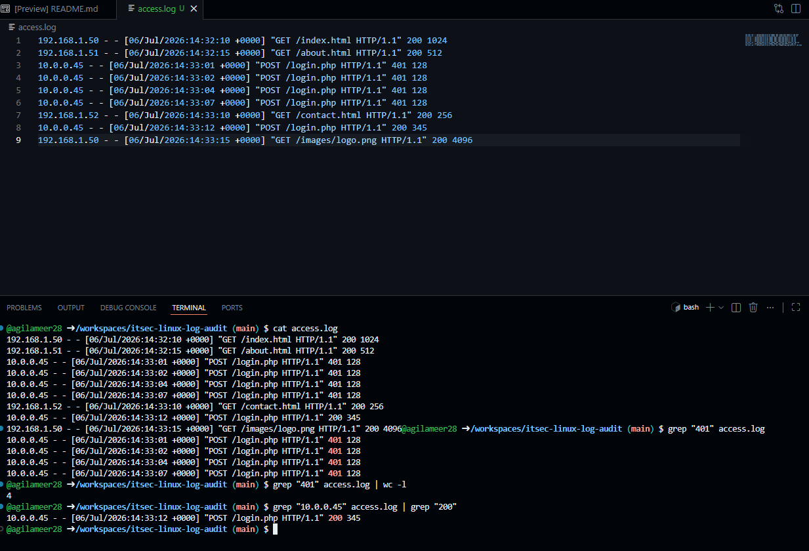

### Summary
Conducted a mock security audit on web server logs using the Linux Command Line Interface (CLI) to identify a brute-force authentication attack.

### Environment
* **Platform:** GitHub Codespaces (Ubuntu Linux)
* **Concepts:** CLI Navigation, Log Analysis, Text Parsing (`grep`), Pipelining (`|`), HTTP Status Codes.

### Diagnostic / Execution Steps
1. Provisioned a cloud-based Linux environment and generated a mock `access.log` file.
2. Utilized `cat` to output and review raw web server traffic data.
3. Executed `grep "401"` to isolate failed authentication attempts and identify the attacker's IP address (`10.0.0.45`).
4. Piped output into `wc -l` to quantify the exact number of brute-force attempts.
5. Correlated the attacker's IP with HTTP status `200` to confirm a successful breach of the `login.php` endpoint.

### Evidence

### Lessons Learned
GUI tools are not always available during an active incident. Mastery of core Linux CLI utilities like `grep` and piping is essential for rapid log parsing and threat hunting.
